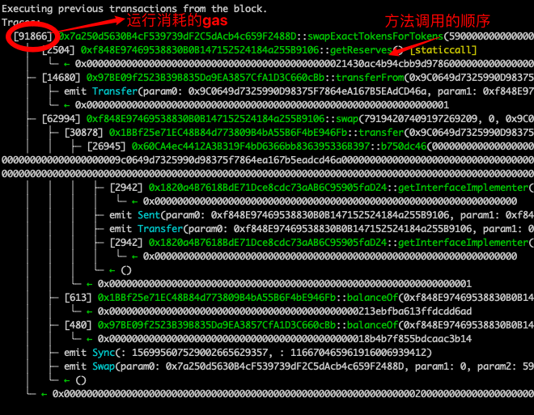

# Solidity - Introdução Simplificada às Ferramentas 7: Foundry, um Kit de Desenvolvimento Centrado em Solidity

Recentemente, estou reaprendendo solidity para reforçar os detalhes e também escrevendo um "Solidity - Introdução Simplificada" para iniciantes usarem. Atualizações de 1 a 3 palestras por semana.

Twitter: [@0xAA_Science](https://twitter.com/0xAA_Science)

Comunidade: [Discord](https://discord.gg/5akcruXrsk)｜[Grupo WeChat](https://docs.google.com/forms/d/e/1FAIpQLSe4KGT8Sh6sJ7hedQRuIYirOoZK_85miz3dw7vA1-YjodgJ-A/viewform?usp=sf_link)｜[Site Oficial wtf.academy](https://wtf.academy)

Todo o código e tutoriais são de código aberto no GitHub: [github.com/AmazingAng/WTF-Solidity](https://github.com/AmazingAng/WTF-Solidity)

-----

## O que é Foundry?
De acordo com a introdução da ferramenta no [site oficial (getfoundry.sh)](https://getfoundry.sh):

> Foundry é um kit de ferramentas extremamente rápido, portátil e modular para o desenvolvimento de aplicações Ethereum, escrito em Rust.

Recursos do projeto:
- Site oficial: [https://getfoundry.sh](https://getfoundry.sh)
- Repositório GitHub: [https://github.com/foundry-rs/foundry](https://github.com/foundry-rs/foundry)
- Documentação: [https://book.getfoundry.sh](https://book.getfoundry.sh)

Explicação da introdução:
- **Escrito em Rust**: Foundry é totalmente desenvolvido em Rust, [o repositório de código-fonte no GitHub](https://github.com/foundry-rs/foundry) é um projeto em Rust. Podemos obter [os arquivos binários da Release](https://github.com/foundry-rs/foundry/releases), ou também podemos compilar e instalar usando o gerenciador de pacotes cargo do Rust [compilando e instalando a partir do código-fonte](https://github.com/foundry-rs/foundry#installing-from-source);
- **Para o desenvolvimento de aplicações Ethereum**: Foundry serve como uma ferramenta "engenharia" para o desenvolvimento de projetos/aplicações Ethereum (linguagem Solidity), fornecendo um ambiente de desenvolvimento Solidity profissional e "cadeia de ferramentas". **Com ele, você pode rapidamente e convenientemente completar o gerenciamento de dependências, compilação, execução de testes, implantação, e pode interagir com a cadeia através da linha de comando e scripts Solidity**;
- **Extremamente rápido**: Foundry utiliza [ethers-solc](https://github.com/gakonst/ethers-rs/tree/master/ethers-solc/) e, em comparação com os testes/trabalhos tradicionais auxiliados por Node.js, a construção e execução de testes do Foundry são muito rápidas (criar um projeto, escrever alguns casos de teste e executá-los para sentir o impacto);
- **Portátil**: Projetos Foundry suportam integração com outros tipos de projetos (como: [integração com Hardhat](https://book.getfoundry.sh/config/hardhat));
- **Modular**: Através do git submodule & mapeamento de diretórios de construção, é rápido e conveniente introduzir dependências;

## Por que escolher Foundry?

Se você se encaixa nas condições abaixo ou teve experiências semelhantes, você definitivamente deve experimentar Foundry:

- Se você é um desenvolvedor de aplicações Ethereum (linguagem Solidity) profissional;
- Você já usou ferramentas como Hardhat.js;
- Você está cansado de esperar por um grande número de casos de teste e precisa de uma ferramenta **mais rápida** para executar seus casos de teste;
- Você acha que lidar com BigNumber é um pouco 🤏 complicado;
- Você teve a necessidade de **completar casos de teste** (ou contratos de teste de contratos) **usando a própria linguagem Solidity**;
- Você acha que gerenciar dependências através do git submodule é mais conveniente (em vez de npm);
- ...

Se você se encaixa nas condições abaixo, Foundry pode não ser adequado para você:
- Iniciantes em Solidity;
- Seu projeto não precisa escrever casos de teste, não precisa de muita automação no aspecto do projeto Solidity;

## Principais funcionalidades do Foundry
> Esta seção é baseada no Foundry book ([https://book.getfoundry.sh](https://book.getfoundry.sh)), tornando a compreensão dos capítulos mais fácil.

- [Criar projetos de desenvolvimento de contratos inteligentes Ethereum (Solidity)](https://book.getfoundry.sh/projects/creating-a-new-project), [trabalhar em projetos existentes](https://book.getfoundry.sh/projects/working-on-an-existing-project);
- [Gerenciar dependências de contratos inteligentes Ethereum (Solidity)](https://book.getfoundry.sh/projects/dependencies);
- [Criar casos de teste escritos em linguagem Solidity (e executar casos de teste rapidamente)](https://book.getfoundry.sh/forge/writing-tests): e suporta [teste de fuzz](https://book.getfoundry.sh/forge/fuzz-testing) e [teste diferencial](https://book.getfoundry.sh/forge/differential-ffi-testing) e outros métodos de teste convenientes e profissionais;
- Através de [Cheatcodes (códigos de trapaça)](https://book.getfoundry.sh/forge/cheatcodes) em casos de teste escritos em linguagem Solidity **interagir e afirmar com funcionalidades "fora do ambiente EVM"**: mudar o endereço da carteira do executor do caso de teste (mudar `msg.sender`), afirmar eventos fora do EVM;
- Rastreamento de execução e erros: [rastreamento de erros em nível de "pilha de funções" (Traces)](https://book.getfoundry.sh/forge/traces);
- [Implantar contratos e completar automaticamente a verificação de código aberto no scan](https://book.getfoundry.sh/forge/deploying);
- Suporte no projeto para [rastreamento completo do uso de gas](https://book.getfoundry.sh/forge/gas-tracking): incluindo detalhes do uso de gas do contrato de teste e relatórios de gas;
- [Depurador interativo](https://book.getfoundry.sh/forge/debugger);

## Componentes do Foundry

O projeto Foundry é composto por várias partes (ferramentas de linha de comando): `Forge`, `Cast`, `Anvil`

- Forge: Ferramenta de linha de comando no projeto Foundry para **executar inicialização do projeto, gerenciamento de dependências, testes, construção, implantação de contratos inteligentes**;
- Cast: Ferramenta de linha de comando no projeto Foundry para **interagir com nós RPC**. Pode ser usada para chamar contratos inteligentes, enviar dados de transação ou recuperar qualquer tipo de dados na cadeia;
- Anvil: Ferramenta de linha de comando no projeto Foundry para **iniciar uma rede de teste/local**. Pode ser usada em conjunto com testes de aplicativos front-end e contratos implantados nessa rede de teste ou para interagir através de RPC;

## Uso Rápido --- Criando um Projeto Foundry

> O conteúdo vem da seção Getting Start do Foundry book

Processo a ser completado:
1. Instalar Foundry;
2. Inicializar um projeto Foundry;
3. Entender os contratos inteligentes e casos de teste adicionados durante a inicialização;
4. Executar construção & teste;

### Instalar Foundry

Para diferentes ambientes:
- MacOS / Linux (e sistemas semelhantes ao Unix):
  - Instalação através de `foundryup` (👈 método recomendado pela página inicial do projeto Foundry);
  - Instalação através da construção a partir do código-fonte;
- Windows
  - Instalação através da construção a partir do código-fonte;
- Ambiente Docker
  - Consulte Foundry Package: [https://github.com/gakonst/foundry/pkgs/container/foundry](https://github.com/gakonst/foundry/pkgs/container/foundry)
- GitHub Action: Para construir um fluxo completo de Action
  - Consulte [https://github.com/foundry-rs/foundry-toolchain](https://github.com/foundry-rs/foundry-toolchain)

---

#### Instalação rápida através de [script](https://raw.githubusercontent.com/foundry-rs/foundry/master/foundryup/install)
Instalação rápida em ambientes com `bash` (ou ambientes semelhantes ao Unix)
```shell
$ curl -L https://foundry.paradigm.xyz | bash
```
Após a execução, será instalado o `foundryup`, execute-o em seguida
```shell
$ foundryup
```
Se tudo correr bem, agora você pode usar três arquivos binários: `forge`, `cast` e `anvil`.

### Inicializar um Projeto Foundry

Inicialize o projeto "hello_wtf" com `forge init`
```shell
$ forge init hello_wtf

Inicializando /Users/username/hello_wtf...
Instalando forge-std em "/Users/username/hello_wtf/lib/forge-std" (url: Some("https://github.com/foundry-rs/forge-std"), tag: None)
    Instalado forge-std
    Projeto forge inicializado.
```
Este processo inicializa um projeto Foundry instalando a dependência `forge-std`

Na estrutura do diretório do projeto, você verá

```shell
$ tree -L 2 
.
├── foundry.toml        # Arquivo de configuração do pacote Foundry
├── lib                 # Bibliotecas de dependência do Foundry
│   └── forge-std       # Dependência básica da ferramenta forge
├── script              # Scripts do Foundry
│   └── Counter.s.sol   # Script do contrato de exemplo Counter
├── src                 # Lógica de negócios dos contratos inteligentes, o código-fonte será colocado aqui
│   └── Counter.sol     # Contrato de exemplo
└── test                # Diretório de casos de teste
    └── Counter.t.sol   # Caso de teste do contrato de exemplo
```
Nota:
- As dependências são tratadas como git submodule no diretório `./lib`
- Para detalhes sobre o arquivo de configuração do pacote Foundry, consulte: [https://github.com/foundry-rs/foundry/blob/master/config/README.md#all-options](https://github.com/foundry-rs/foundry/blob/master/config/README.md#all-options)

### Entender os Contratos Inteligentes e Casos de Teste Adicionados Durante a Inicialização

#### Diretório src

Principalmente composto pela lógica de negócios
`src` diretório `./src/Counter.sol`:
```solidity
// SPDX-License-Identifier: UNLICENSED
pragma solidity ^0.8.13;

contract Counter {          // Um contrato Counter muito simples
    uint256 public number;  // Mantém um número uint256 público

    // Define o conteúdo da variável number
    function setNumber(uint256 newNumber) public { 
        number = newNumber;
    }

    // Incrementa o conteúdo da variável number
    function increment() public {
        number++;
    }
}
```

#### Diretório script

Consulte a documentação do projeto Foundry em [Solidity-scripting](https://book.getfoundry.sh/tutorials/solidity-scripting) Este diretório é principalmente composto por scripts de "implantação" (também pode usar esses scripts para chamar funcionalidades `vm` fornecidas pelo Foundry para realizar funcionalidades avançadas além da lógica de aplicação, equivalente aos scripts em Hardhat.js).

Veja `./script/Counter.s.sol`:

```solidity
// SPDX-License-Identifier: UNLICENSED
pragma solidity ^0.8.13; // Licença e identificação da versão Solidity

import "forge-std/Script.sol"; // Importa a biblioteca Script do forge foundry
import "../src/Counter.sol"; // Importa o contrato Counter a ser implantado

// O script de implantação herda o contrato Script
contract CounterScript is Script {
    // Função opcional, chamada antes de cada função ser executada
    function setUp() public {}

    // A função run() é chamada ao implantar o contrato
    function run() public {
        vm.startBroadcast(); // Começa a gravar chamadas e criações de contratos no script
        new Counter(); // Cria o contrato
        vm.stopBroadcast(); // Termina a gravação
    }
}
```

O script de implantação do Foundry é um contrato inteligente escrito em Solidity, que, embora não seja implantado, segue a especificação Solidity. Você pode executar o script e implantar o contrato com `forge script`.

```shell
forge script script/Counter.s.sol:CounterScript
```

#### Diretório test

Principalmente composto por casos de teste do contrato

Diretório `test` `./test/Counter.t.sol`

```solidity
// SPDX-License-Identifier: UNLICENSED
pragma solidity ^0.8.13;

import "forge-std/Test.sol";        // Importa a dependência de teste do forge-std
import "../src/Counter.sol";        // Importa o contrato de negócios a ser testado

// Implementa casos de teste com base na dependência de teste do forge-std
contract CounterTest is Test {      
    Counter public counter;

    // Inicializa o caso de teste
    function setUp() public { 
       counter = new Counter();
       counter.setNumber(0);
    }

    // Baseado no caso de teste inicializado
    // Afirma que o retorno do número do contador após o incremento é igual a 1
    function testIncrement() public {
        counter.increment();
        assertEq(counter.number(), 1);
    }

    // Baseado no caso de teste inicializado
    // Executa teste diferencial
    // Durante o teste do forge
    // Passa diferentes valores uint256 x como parâmetros para a função testSetNumber
    // Testa a função setNumber do contador para definir diferentes números para x
    // Afirma que o retorno de number() é igual ao parâmetro x do teste diferencial
    function testSetNumber(uint256 x) public {
        counter.setNumber(x);
        assertEq(counter.number(), x);
    }

    // Teste diferencial: consulte https://book.getfoundry.sh/forge/differential-ffi-testing
}
```

### Executar Construção & Teste

No diretório do projeto, execute `forge build` para completar a construção
```shell
$ forge build

[⠒] Compilando...
[⠢] Compilando 10 arquivos com 0.8.17
[⠰] Solc 0.8.17 terminou em 1.06s
Execução do compilador bem-sucedida
```

Após a construção, execute `forge test` para completar o teste
```shell
$ forge test

[⠢] Compilando...
Nenhum arquivo alterado, compilação pulada

Executando 2 testes para test/Counter.t.sol:CounterTest
[PASS] testIncrement() (gas: 28312)
[PASS] testSetNumber(uint256) (execuções: 256, μ: 27609, ~: 28387)
Resultado do teste: ok. 2 passaram; 0 falharam; terminado em 9.98ms
```

Até aqui, você completou o processo de começar a usar Foundry e inicializou um projeto.

## Uso Avançado do Foundry Cast
Principalmente introduzindo o uso do Foundry Cast, usando Cast na linha de comando para alcançar o efeito do [Ethereum (ETH) Blockchain Explorer](https://etherscan.io/).

Pratique os seguintes objetivos
* Consultar blocos
* Consultar transações
* Decodificar transações
* Gerenciamento de contas
* Consulta de contratos
* Interação com contratos
* Decodificação de codificação
* Simulação de transações na cadeia local

## Relacionado a Blocos

### Consultar Blocos

```shell
# $RPC_MAIN substituído pelo endereço RPC necessário
cast block-number --rpc-url=$RPC_MAIN
```

Resultado da saída:

```
15769241
```

> Definindo a variável de ambiente `ETH_RPC_URL` como `--rpc-url`, você não precisa adicionar `--rpc-url=$RPC_MAIN` em cada comando de linha. Aqui, eu configurei diretamente para a rede principal.

### Consultar Informações do Bloco

```shell
# cast block <BLOCK> --rpc-url=$RPC_MAIN

cast block 15769241 --rpc-url=$RPC_MAIN

# Formatar

cast block 15769241 --json --rpc-url=$RPC_MAIN
```

Resultado da saída:

```shell 
baseFeePerGas        22188748210
difficulty           0
extraData            0x
gasLimit             30000000
gasUsed              10595142
hash                 0x016e71f4130bac96a20761acbc0ba82a77c26f85513f1661adfd406d1c809543
logsBloom            0x1c6150404140580410990400a61d01e30030b00100c2a6310b11b9405d012980125671129881101011501d399081855523a106443aef3ab07148626315f721550290981058030b2af90b213961204c6103d2002a076c9e12d0800475b8231f0d06a20100da57c60aa0c008280128284418503340087c8650104c34500c18aa1c2070878008c21c64207d1424000244811415afc507640448122060644c181204ba412f0af11365020880508105551226004c0801c1840183003a42062a5a2444c13266020c00081440008038492740a8204a0c6c050a29d52405b92e4b20f028a97a604c6b0849ca81c4d06009258b4206217803a168824484deb8513242f082
miner                0x4675C7e5BaAFBFFbca748158bEcBA61ef3b0a263
mixHash              0x09b7a94ef1d6c93caaff49ca8bf387652e0e33e116076b61f4d5ee79f0b91f92
nonce                0x0000000000000000
number               15769241
parentHash           0x95c60d89f2275a6a7b1a9545cf1fb6d8c614402cd7311c82bc7972c177f7812d
receiptsRoot         0xe0240d60c448387123e412114cd0165b2af7b926d34bb824f8c544b022aa76f9
sealFields           []
sha3Uncles           0x1dcc4de8dec75d7aab85b567b6ccd41ad312451b948a7413f0a142fd40d49347
size                 149912
stateRoot            0xaa3e9d839e99c4791827c81df9c9129028a320432920205f191e3fb261d0951c
timestamp            1666026803
totalDifficulty      58750003716598352816469
transactions:        [
	0xc4f5c10e4419698edaf7431df464340b389e4b79db959d58f42e82e8d1ed18ae
	0xb90edeacf833ac6cb91a326c775ed86d8047a467404bd8c69782d2260983eaad
	0x6f280650e35238ab930c9a0f3163443fffe2efedc5b553f408174d4bcd89cd8d
	0x2e0eafea64aaf2f53240a16b11a4f250ba74ab9ca5a1a90e6f2a6e92185877d2
	0x34f41d22ed8209da379691640cec5bfb8bf9404ad0f7264709b7959d61532343
	0x7569ab5ce2d1ca13a0c65ad52cc901dfc186e8ff8800793550b97760cbe34db2
	0xcdeef0ffe859fcf96fb52e22a9789295c6f1a94280df9faf0ebb9d52abefb3e7
	0x00d6793f3dbdd616351441b9e3da9a0de51370174e0d9383b4aae5c3c9806c2a
	0xff3daf63a431af021351d3da5f2f39a894352328d7f3df96afab1888f5a7093f
	0x7938399bee5293c384831c8e5aa698cdb491d568f9ebfb6d5c946f4ef7bf7e51
	0x20e7dda515f04ea6a787f68689e27bcadbba914184da5336204f3f36771f59f0
	0x0435d78a1b62484fbe3a7680d68ba4bdf0d692f087f4a6b70eb377421c58a5dd
	0xe16d1fa4d60cca7447850337c63cdf7b888318cc1bbb893b115f262dc01132d7
	0x44af4f696dcfedee682d7e511ad2469780443052565eea731b86b652a175c05e
	0xe88732f92ac376efb6e7517e66fc586447e0d065b8686556f2c1a7c3b7a519ce
	0x7ee890b096e97fc0c7e3cf74e0f0402532e0f3b8fa0e0c494d3d691d031f57e7
	...]
```

## Relacionado a Transações

### Consultar Transações

```shell
# Semelhante ao provider.getTransaction do ethersjs
# cast tx <HASH> [FIELD] --rpc-url=$RPC

# Semelhante ao provider.getTransactionReceipt do ethersjs
# cast receipt <HASH> [FIELD] --rpc-url=$RPC 

cast tx 0x20e7dda515f04ea6a787f68689e27bcadbba914184da5336204f3f36771f59f0 --rpc-url=$RPC 

cast receipt 0x20e7dda515f04ea6a787f68689e27bcadbba914184da5336204f3f36771f59f0 --rpc-url=$RPC

# Para obter apenas os logs

cast receipt 0x20e7dda515f04ea6a787f68689e27bcadbba914184da5336204f3f36771f59f0 logs --rpc-url=$RPC

```

Resultado da primeira linha de comando:

```shell
blockHash            0x016e71f4130bac96a20761acbc0ba82a77c26f85513f1661adfd406d1c809543
blockNumber          15769241
from                 0x9C0649d7325990D98375F7864eA167B5EAdCD46a
gas                  313863
gasPrice             35000000000
hash                 0x20e7dda515f04ea6a787f68689e27bcadbba914184da5336204f3f36771f59f0
input                0x38ed173900000000000000000000000000000000000000000000000332ca1b67940c000000000000000000000000000000000000000000000000000416b4849e6ba1475000000000000000000000000000000000000000000000000000000000000000a00000000000000000000000009c0649d7325990d98375f7864ea167b5eadcd46a00000000000000000000000000000000000000000000000000000000634d91c1000000000000000000000000000000000000000000000000000000000000000200000000000000000000000097be09f2523b39b835da9ea3857cfa1d3c660cbb0000000000000000000000001bbf25e71ec48b84d773809b4ba55b6f4be946fb
nonce                14
r                    0x288aef25af73a4d1916f8d37107ef5f24729a423f23acc38920829c4180fe794
s                    0x7644d26a91da02ff1e774cc821febf6387b8ee9f3e3085140b781819d0d8ede0
to                   0x7a250d5630B4cF539739dF2C5dAcb4c659F2488D
transactionIndex     10
v                    38
value                0
```

Resultado da segunda linha de comando:

```shell
blockHash               0x016e71f4130bac96a20761acbc0ba82a77c26f85513f1661adfd406d1c809543
blockNumber             15769241
contractAddress
cumulativeGasUsed       805082
effectiveGasPrice       35000000000
gasUsed                 114938
logs                    [{"address":"0x97be09f2523b39b835da9ea3857cfa1d3c660cbb","topics":["0xddf252ad1be2c89b69c2b068fc378daa952ba7f163c4a11628f55a4df523b3ef","0x0000000000000000000000009c0649d7325990d98375f7864ea167b5eadcd46a","0x000000000000000000000000f848e97469538830b0b147152524184a255b9106"],"data":"0x00000000000000000000000000000000000000000000000332ca1b67940c0000","blockHash":"0x016e71f4130bac96a20761acbc0ba82a77c26f85513f1661adfd406d1c809543","blockNumber":"0xf09e99","transactionHash":"0x20e7dda515f04ea6a787f68689e27bcadbba914184da5336204f3f36771f59f0","transactionIndex":"0xa","logIndex":"0x2","removed":false},{"address":"0x1bbf25e71ec48b84d773809b4ba55b6f4be946fb","topics":["0x06b541ddaa720db2b10a4d0cdac39b8d360425fc073085fac19bc82614677987","0x000000000000000000000000f848e97469538830b0b147152524184a255b9106","0x000000000000000000000000f848e97469538830b0b147152524184a255b9106","0x0000000000000000000000009c0649d7325990d98375f7864ea167b5eadcd46a"],"data":"0x0000000000000000000000000000000000000000000000044b0a580cbdcfc0d90000000000000000000000000000000000000000000000000000000000000060000000000000000000000000000000000000000000000000000000000000008000000000000000000000000000000000000000000000000000000000000000000000000000000000000000000000000000000000000000000000000000000000","blockHash":"0x016e71f4130bac96a20761acbc0ba82a77c26f85513f1661adfd406d1c809543","blockNumber":"0xf09e99","transactionHash":"0x20e7dda515f04ea6a787f68689e27bcadbba914184da5336204f3f36771f59f0","transactionIndex":"0xa","logIndex":"0x3","removed":false},{"address":"0x1bbf25e71ec48b84d773809b4ba55b6f4be946fb","topics":["0xddf252ad1be2c89b69c2b068fc378daa952ba7f163c4a11628f55a4df523b3ef","0x000000000000000000000000f848e97469538830b0b147152524184a255b9106","0x0000000000000000000000009c0649d7325990d98375f7864ea167b5eadcd46a"],"data":"0x0000000000000000000000000000000000000000000000044b0a580cbdcfc0d9","blockHash":"0x016e71f4130bac96a20761acbc0ba82a77c26f85513f1661adfd406d1c809543","blockNumber":"0xf09e99","transactionHash":"0x20e7dda515f04ea6a787f68689e27bcadbba914184da5336204f3f36771f59f0","transactionIndex":"0xa","logIndex":"0x4","removed":false},{"address":"0xf848e97469538830b0b147152524184a255b9106","topics":["0x1c411e9a96e071241c2f21f7726b17ae89e3cab4c78be50e062b03a9fffbbad1"],"data":"0x00000000000000000000000000000000000000000000213ebfba613ffdcdd6ad0000000000000000000000000000000000000000000018b4b7f855bdcaac3b14","blockHash":"0x016e71f4130bac96a20761acbc0ba82a77c26f85513f1661adfd406d1c809543","blockNumber":"0xf09e99","transactionHash":"0x20e7dda515f04ea6a787f68689e27bcadbba914184da5336204f3f36771f59f0","transactionIndex":"0xa","logIndex":"0x5","removed":false},{"address":"0xf848e97469538830b0b147152524184a255b9106","topics":["0xd78ad95fa46c994b6551d0da85fc275fe613ce37657fb8d5e3d130840159d822","0x0000000000000000000000007a250d5630b4cf539739df2c5dacb4c659f2488d","0x0000000000000000000000009c0649d7325990d98375f7864ea167b5eadcd46a"],"data":"0x000000000000000000000000000000000000000000000000000000000000000000000000000000000000000000000000000000000000000332ca1b67940c00000000000000000000000000000000000000000000000000044b0a580cbdcfc0d90000000000000000000000000000000000000000000000000000000000000000","blockHash":"0x016e71f4130bac96a20761acbc0ba82a77c26f85513f1661adfd406d1c809543","blockNumber":"0xf09e99","transactionHash":"0x20e7dda515f04ea6a787f68689e27bcadbba914184da5336204f3f36771f59f0","transactionIndex":"0xa","logIndex":"0x6","removed":false}]
logsBloom               0x00200000000000000000000080000000000000000000000000010000000008000000000000800000000000000000000000000000002000000000000000000000000000000000000000000008000000200000000000000000000000400000100000000000800000002000000000000000000000400000000000010000000000000000000000000005000000000040000000000000000080000004004000000000000084100000000000000000000000000000040000000000000000000040000000002000000000000000000000000000000000000001000002000000020000000000000000000000000000000000000004000000000000000000000000000
root
status                  1
transactionHash         0x20e7dda515f04ea6a787f68689e27bcadbba914184da5336204f3f36771f59f0
transactionIndex        10
type                    0
```

### Decodificar Transações

Cast pode decodificar o nome do método a partir do [Ethereum Signature Database](https://sig.eth.samczsun.com).

```shell
# cast 4byte <SELECTOR> para decodificar o nome da transação
cast 4byte 0x38ed1739
```

Resultado da saída:

```shell
swapExactTokensForTokens(uint256,uint256,address[],address,uint256)
```

### Assinatura da Transação

> Usando Keccak-256 para calcular o nome do método
> O seletor de função é os primeiros 4 bytes do hash Keccak-256 do protótipo da função[1]. Isso permite que a EVM identifique a função a ser chamada com precisão.

Assinatura da transação:

```shell
# cast sig <SIG>

cast sig "swapExactTokensForTokens(uint256,uint256,address[],address,uint256)"

```

Resultado da saída:

```shell
0x38ed1739
```

Portanto, você pode ver que o resultado final é `0x38ed1739`

Alguns nomes de métodos podem não estar disponíveis, você pode carregar a assinatura para o [Ethereum Signature Database](https://sig.eth.samczsun.com) usando `cast upload-signature <SIG>`.

### Decodificar Dados da Transação

```shell
# Obter calldata
cast tx 0x20e7dda515f04ea6a787f68689e27bcadbba914184da5336204f3f36771f59f0 input --rpc-url=$RPC

# Pode usar este método para decodificar os dados da transação, semelhante ao método de decodificação do etherscan
# cast pretty-calldata <CALLDATA>
cast pretty-calldata 0x38ed173900000000000000000000000000000000000000000000000332ca1b67940c000000000000000000000000000000000000000000000000000416b4849e6ba1475000000000000000000000000000000000000000000000000000000000000000a00000000000000000000000009c0649d7325990d98375f7864ea167b5eadcd46a00000000000000000000000000000000000000000000000000000000634d91c1000000000000000000000000000000000000000000000000000000000000000200000000000000000000000097be09f2523b39b835da9ea3857cfa1d3c660cbb0000000000000000000000001bbf25e71ec48b84d773809b4ba55b6f4be946fb
```

Resultado da saída:

```shell
 Métodos possíveis:
 - swapExactTokensForTokens(uint256,uint256,address[],address,uint256)
 ------------
 [0]:  00000000000000000000000000000000000000000000000332ca1b67940c0000
 [1]:  00000000000000000000000000000000000000000000000416b4849e6ba14750
 [2]:  00000000000000000000000000000000000000000000000000000000000000a0
 [3]:  0000000000000000000000009c0649d7325990d98375f7864ea167b5eadcd46a
 [4]:  00000000000000000000000000000000000000000000000000000000634d91c1
 [5]:  0000000000000000000000000000000000000000000000000000000000000002
 [6]:  00000000000000000000000097be09f2523b39b835da9ea3857cfa1d3c660cbb
 [7]:  0000000000000000000000001bbf25e71ec48b84d773809b4ba55b6f4be946fb
```

### Simulação de Execução

```
# Uso: cast run --rpc-url <URL> <TXHASH>

cast run 0x20e7dda515f04ea6a787f68689e27bcadbba914184da5336204f3f36771f59f0
```

Resultado da execução:



No resultado, você pode ver o gás consumido pela execução, bem como o processo de chamada de métodos e os eventos emitidos. Isso permite entender o processo interno de um hash. Ferramentas como [BlockSec Building BlockChain Security Infrastructure](https://blocksec.com/) e [Tenderly | Ethereum Developer Platform](https://tenderly.co/) podem ser usadas em conjunto para análise.

## Gerenciamento de Contas

### Criar Nova Conta

```shell
# Criar uma nova conta
# cast wallet new [OUT_DIR] 
cast wallet new

# Criar uma nova conta keystore com senha
# cast wallet new <PATH>
cast wallet new  ~/Downloads
```

Resultado da primeira linha de comando:

```shell
Successfully created new key pair.
Address: 0xDD20b18E001A80d8b27B8Caa94EeAC884D1c****
Private Key: edb4444199bddea91879c0214af27c0c7f99****bf18e46ba4078a39ccdbe0bc
```

Resultado da segunda linha de comando:

```shell
Enter secret:
Created new encrypted keystore file: `/Users/EasyPlux/Downloads/b5832df5-21e9-4959-8c85-969eec9c0***`\nPublic Address of the key: 0x58c1C8f6A7D92A9b20A5343949cd624570Ab****
```

### Assinatura de Conta

```shell
# Duas maneiras de assinar, a primeira carregando a chave privada do keystore criado anteriormente, a segunda inserindo diretamente sua própria chave privada.
cast wallet sign <MESSAGE> --keystore=<PATH> 
cast wallet sign <MESSAGE> -i
```

### Verificação de Conta

```shell
cast wallet verify --address <ADDRESS> <MESSAGE> <SIGNATURE> 
```

## Interação com Contratos

### Obter Contrato

```shell
cast etherscan-source <endereço do contrato>

cast etherscan-source 0xC02aaA39b223FE8D0A0e5C4F27eAD9083C756Cc2 --etherscan-api-key='chave'

```

### Baixar Contrato

```shell
#cast etherscan-source -d <caminho>
# Aqui, já inseri o endereço $WETH na variável de ambiente, se não tiver feito isso, pode usar o endereço do contrato diretamente
cast etherscan-source $WETH -d ~/Downloads
```

### Chamar Contrato

Chamando o método `balanceOf` do contrato WETH, para verificar o saldo da conta `0xC02aaA39b223FE8D0A0e5C4F27eAD9083C756Cc2`

```shell
#cast call [OPÇÕES] [PARA] [ASSINATURA] [ARGS]... [COMANDO] --rpc-url=$RPC

cast call $WETH "balanceOf(address)" 0xC02aaA39b223FE8D0A0e5C4F27eAD9083C756Cc2 --rpc-url=$RPC

# Saída
# 0x0000000000000000000000000000000000000000000000230d12770f2845219c

# Formatar saída adicionando um formato de retorno ao parâmetro

cast call $WETH "balanceOf(address)(uint256)" 0xC02aaA39b223FE8D0A0e5C4F27eAD9083C756Cc2 --rpc-url=$RPC

# Saída
# 646577988758891995548

```

### Decodificar ABI

Com base na ABI, é possível reverter para o código Solidity
```shell
# cast interface [OPÇÕES] <CAMINHO_OU_ENDEREÇO>
cast interface ./weth.abi
```

## Codificação e Decodificação

```shell
cast --to-hex 

cast --to-dec 

cast --to-unit 

cast --to-wei 

cast --to-rlp 

cast --from-rlp

```

## Dicas

### Configurar ETH_RPC_URL
Definindo a variável de ambiente `ETH_RPC_URL` como `--rpc-url`, você não precisa adicionar `--rpc-url=$RPC_MAIN` em cada comando de linha. Aqui, configurei diretamente para a rede principal.

### Configurar ETHERSCAN_API_KEY
Definindo a variável de ambiente `ETHERSCAN_API_KEY`, você pode substituir diretamente `--etherscan-api-key`.

### Formatação JSON

Adicionando `--json` pode formatar a saída

```shell
cast block 15769241 --json --rpc-url=$RPC_MAIN
```

## Uso do Anvil como Nó Local

### Comandos Básicos

Anvil, assim como Hardhat e Ganache do Truffle, é um nó Ethereum local, que também possui funcionalidades de fork.

```shell
anvil 
anvil --accounts=<NUM> --balance=<NUM> 
anvil --mnemonic=<MNEMONIC> 
anvil --fork-url=$RPC --fork-block-number=<BLOCK>
```

### Uso do RPC

```shell
anvil_* -> hardhat_* 

anvil_impersonateAccount 

anvil_setStorageAt
```

## Uso Avançado do Forge

Código localizado em `WTFSolidity/Topics/Tools/TOOL07_Foundry/hello_wtf`

Estrutura do diretório de código:

```shell
.
├── broadcast
│   └── Counter.s.sol 
├── foundry.toml        # Arquivo de configuração do foundry
├── lib
│   └── forge-std
├── node_modules        # Diretório de pacotes npm, também pode usar forge install
│   └── @openzeppelin
├── package-lock.json
├── package.json
├── script
│   └── Counter.s.sol   # Contrato de script
├── src
│   └── Counter.sol
└── test
    ├── Counter.t.sol
    └── Test.t.sol      # Contrato de teste
```

### Inicializar Projeto
```shell

forge init <nome_dir> 

# Inicializar projeto com template
forge init --template <caminho_template> <nome_dir>

```

## Atualização em Tempo Real

```shell
forge build -w
```


### Testes

```shell
# Três vs mostram informações detalhadas de log, incluindo rastreamento de pilha de erros de testes falhos
forge test -vvv
# Quatro vs mostram rastreamento de pilha de todos os testes e rastreamento de configuração de testes falhos
forge test -vvvv
# Modo de atualização em tempo real
forge test -vvv -w

# Para imprimir logs, é necessário -vv ou mais
```

Usando `console2.log("teste")` para imprimir:

```solidity

function testSetNumber(uint256 x) public {
        console2.log("testNumber: %s==============", x);
        counter.setNumber(x);
        assertEq(counter.number(), x);
    }
```

Usando `emit log` para imprimir:

```solidity
function testNumberIs42() public {
        emit log("teste");
        assertEq(testNumber, 42);
    }
```

Alterar `block.timestamp`:

```solidity

function testCheatCode()public {
  console2.Log("antes:", block.timestamp);
  vm.warp(1000);
  console2.log("depois:", block.timestamp);
}

```

Alterar `msg.sender` (pode simular conta de administrador):

```solidity
// Apenas a primeira vez tem efeito
vm.prank(address)


// Efeito múltiplo
vm.startPrank(address)
...código
vm.stopPrank()

```

Alterar saldo da conta (também pode ser usado para alterar o saldo da maioria dos tokens ERC20):

```solidity
function testCheatCode()public{
	console2.Log("antes:", alice.balance);
	vm.deal(alice,1 ether);
	console2.Log("depois:", alice.balance);
}

```

## Instalar Plugins

### Usar forge para instalar plugins

```shell
forge install [OPÇÕES] <usuário_github>/<projeto_github>@<tag>
```

### Usar npm para instalar plugins

```shell
npm init -y
npm i @openzeppelin/contracts 
// yarn add @openzeppelin/contracts
```

Após a instalação, é necessário configurar o `foundry.toml` para incluir o diretório `node_modules` nas bibliotecas.

```toml
[profile.default]
src = 'src'
out = 'out'
libs = ['lib','node_modules']
```

## Dicas do Forge: 

```shell
forge test --gas-report

# Obter informações relacionadas ao contrato, como abi, bytecode, etc.
forge inspect <CONTRATO> <CAMPO>

# Gerar snapshot de gas
forge snapshot

# Comparar o arquivo de snapshot atual com as últimas alterações para verificar se o gas foi reduzido
forge snapshot --diff 

# Debugger interativo
forge script script/Counter.s.sol --debug

# Debugger de transações na cadeia
forge run --debug

```

## Conclusão

Nesta palestra, introduzimos ferramentas de desenvolvimento centradas em Solidity e mostramos como usar o Foundry para compilar, implantar e testar contratos inteligentes. Como os scripts de implantação e teste do Foundry são escritos em Solidity, isso elimina a necessidade de os desenvolvedores aprenderem JavaScript, economizando tempo e oferecendo mais oportunidades para praticar Solidity. Recomendamos que todos experimentem.

## Referências
[Usando o framework Foundry para acelerar o desenvolvimento de contratos inteligentes](https://www.youtube.com/watch?v=EXYeltwvftw) 
[Comandos cast - Foundry Book](https://book.getfoundry.sh/reference/cast/)
[https://twitter.com/wp__lai](https://twitter.com/wp__lai)

